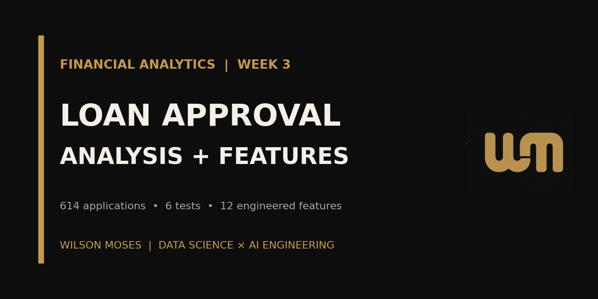
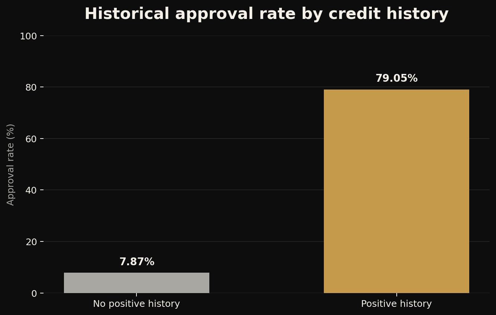
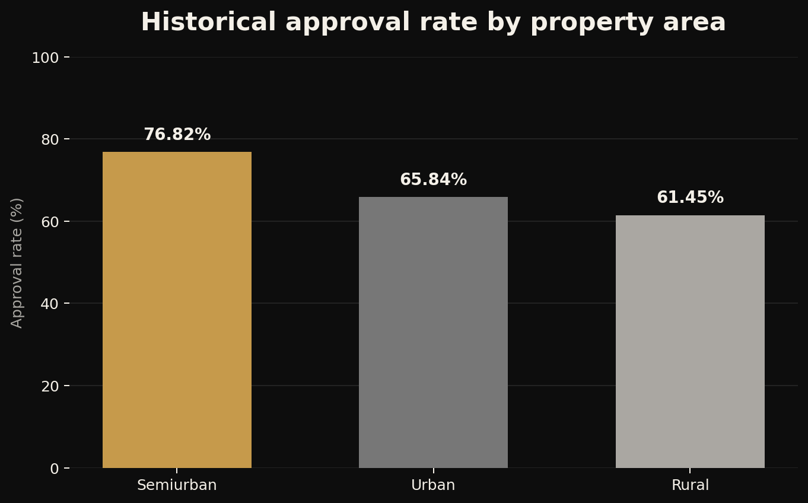
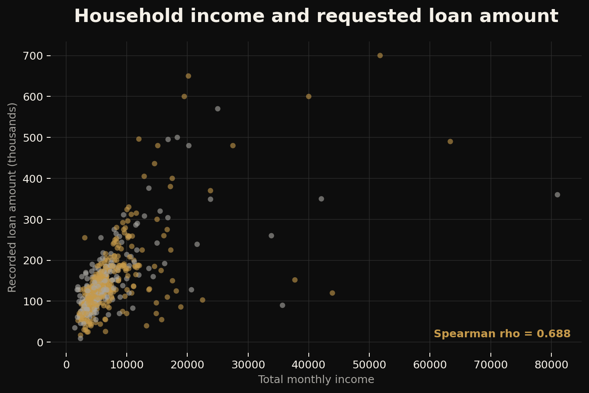

<p align="center">
  
</p>

<p align="center">
  <a href="https://www.linkedin.com/in/wilson-moses-9207b22bb">LinkedIn</a>
  ·
  <a href="https://github.com/WilsonMoses-Data">GitHub</a>
  ·
  <a href="https://www.tiktok.com/@moses.learnsdata">Moses Learns Data</a>
</p>

# Loan Approval Analysis and Feature Engineering

> Statistical analysis and feature engineering for 614 historical loan applications, including six hypothesis tests, 12 engineered features and leakage-safe machine-learning preparation.



## Project snapshot

| Project detail | Information |
|---|---|
| Domain | Financial Analytics |
| Context | AnalystLab Africa Data Science Internship - Week 3 |
| Status | Completed analysis and feature-engineering phase |
| Dataset | 614 historical loan applications |
| Target | `loan_status` (`Y`/`N`) and numerical `approved` (`1`/`0`) |
| Core tools | Python, pandas, NumPy, SciPy, scikit-learn, Matplotlib, Seaborn and Jupyter |
| Deliverables | Executable notebook, four processed datasets, data dictionary, three reports and reproducible visuals |

## Project overview

This project extends the preceding loan-data-preparation phase into statistical inference, multivariate exploration, interpretable feature engineering and leakage-safe preprocessing. It asks which applicant, household, financial and credit-related characteristics are associated with historical loan decisions and how those characteristics can be prepared responsibly for later modelling.

This is an educational portfolio analysis. It does not present a validated lending model and must not be used to make real loan decisions.

## Objectives

1. Revalidate the quality and consistency of the cleaned dataset.
2. Examine distributions, approval patterns and relationships.
3. Test six business questions using appropriate nonparametric methods.
4. Create interpretable household, income, credit and repayment features.
5. Select useful modelling inputs while controlling redundancy and fairness risk.
6. Create a stratified train/test split before fitting encoders and scalers.
7. Translate technical evidence into responsible business recommendations.

## Dataset summary

| Measure | Verified result |
|---|---:|
| Applications analysed | 614 |
| Approved / rejected | 422 / 192 |
| Historical approval rate | 68.73% |
| Engineered features | 12 |
| Final analytical columns | 26 |
| Final encoded predictors | 13 |
| Training / test observations | 491 / 123 |
| Missing values in published outputs | 0 |
| Exact duplicate rows | 0 |

See [data documentation](data/README.md) for file contracts and responsible-use notes.

## Analytical workflow

1. Loaded the upstream cleaned dataset and rechecked quality.
2. Explored financial distributions, categorical rates and outcome differences.
3. Used chi-square, Mann-Whitney U, Kruskal-Wallis and Spearman tests.
4. Quantified categorical effect size with Cramer's V.
5. Created 12 business-readable analytical features.
6. Selected model inputs using evidence, mutual information, interpretability and redundancy controls.
7. Excluded gender from predictive inputs while retaining it for fairness auditing.
8. Split the data 80/20 before fitting encoding and scaling on training data only.

## Statistical findings

| Question | Result | Interpretation |
|---|---|---|
| Credit history vs approval | `p < 0.001`; Cramer's V `0.536` | Strong observed association |
| Property area vs approval | `p = 0.002`; Cramer's V `0.142` | Significant but comparatively weak association |
| Total income by outcome | `p = 0.713` | No significant independent difference |
| Loan amount by outcome | `p = 0.398` | No significant independent difference |
| Total income across property areas | `p = 0.140` | No significant difference |
| Total income vs loan amount | Spearman rho `0.688`; `p < 0.001` | Strong positive relationship |

Credit history is the clearest observed signal, but historical association does not establish causation, fairness or legitimate policy relevance.

## Visual results

### Credit history and approval



### Property area and approval



### Income and requested loan amount



## Feature engineering

The notebook creates 12 features:

| Feature group | Engineered features |
|---|---|
| Household | `dependents_numeric`, `family_size`, `family_size_group` |
| Income | `income_band`, `has_coapplicant_income`, `coapplicant_income_share` |
| Duration and affordability | `term_years`, `estimated_monthly_principal`, `payment_income_ratio` |
| Credit and transformations | `credit_risk_category`, `log_total_income`, `log_loan_amount` |

The repayment-burden measures are proxies. They exclude interest, existing debt, expenses, insurance and verified monthly obligations.

## Repository structure

```text
loan-approval-analysis-feature-engineering/
├── README.md
├── LICENSE
├── requirements.txt
├── data/
│   ├── README.md
│   ├── raw/
│   │   └── loan_prediction_cleaned.csv
│   └── processed/
│       ├── loan_prediction_week3_final_cleaned.csv
│       ├── loan_prediction_week3_ml_ready.csv
│       ├── loan_prediction_week3_test.csv
│       ├── loan_prediction_week3_train.csv
│       └── week3_updated_data_dictionary.csv
├── images/
│   ├── credit-history-approval.png
│   ├── income-loan-relationship.png
│   ├── property-area-approval.png
│   ├── social-preview.png
│   ├── wilson-moses-banner.png
│   └── wilson-moses-logo.png
├── notebooks/
│   └── 01_loan_approval_analysis_and_feature_engineering.ipynb
├── reports/
│   ├── business_insights_report.pdf
│   ├── feature_engineering_documentation.pdf
│   └── statistical_analysis_report.pdf
└── scripts/
    ├── generate_readme_visuals.py
    └── generate_reports.py
```

## Run locally

```bash
git clone https://github.com/WilsonMoses-Data/loan-approval-analysis-feature-engineering.git
cd loan-approval-analysis-feature-engineering

python -m venv .venv
```

Activate the environment:

```bash
# Windows
.venv\Scripts\activate

# macOS or Linux
source .venv/bin/activate
```

Install the dependencies and start Jupyter:

```bash
python -m pip install --upgrade pip
pip install -r requirements.txt
jupyter notebook
```

Open and run `notebooks/01_loan_approval_analysis_and_feature_engineering.ipynb`. Its paths are repository-relative and its generated datasets are written to `data/processed/`.

Regenerate the visual and report assets with:

```bash
python scripts/generate_readme_visuals.py
python scripts/generate_reports.py
```

## Reports

- [Business Insights Report](reports/business_insights_report.pdf)
- [Statistical Analysis Report](reports/statistical_analysis_report.pdf)
- [Feature Engineering Documentation](reports/feature_engineering_documentation.pdf)

The reports follow the same Wilson Moses Data Science Field Notes system used across the portfolio and contain no private contact details.

## Business recommendations

- Prioritise completeness and verification of credit-history information.
- Assess affordability through combined repayment and income indicators rather than isolated thresholds.
- Investigate geographic differences before allowing location to influence policy or operations.
- Preserve the predetermined test set and fit all transformations on training data only.
- Audit subgroup errors and fairness before considering any operational use.

## Limitations and responsible use

- The dataset is small and represents historical approvals, not objective creditworthiness or default risk.
- Historical decisions can reproduce undocumented policy or social bias.
- Important affordability factors and application dates are unavailable.
- Previously imputed values may reduce variation in some variables.
- Statistical significance does not establish causation, practical importance or legal permissibility.
- No production model, deployment or automated lending decision is claimed.

## Skills demonstrated

- Advanced exploratory data analysis
- Statistical hypothesis testing and effect-size interpretation
- Feature engineering and redundancy control
- Mutual-information screening
- Leakage-safe preprocessing
- Responsible feature selection and fairness awareness
- Reproducible notebook and repository design
- Technical and business communication

## Learning reflection

This phase strengthened my ability to move beyond visible patterns and test whether the evidence supports them. The most important lesson was that feature engineering is not simply creating more columns: every feature needs a clear meaning, a valid construction, a modelling purpose and a documented limitation.

## Next steps

- Establish a transparent baseline classifier.
- Compare logistic regression, decision-tree and ensemble approaches.
- Evaluate discrimination, calibration, threshold trade-offs and subgroup performance.
- Interpret the selected model with transparent methods.
- Package preprocessing and modelling into one reproducible pipeline.

## Author

**Wilson Moses**  
Developing Data Scientist × AI Engineer based in Botswana

[LinkedIn](https://www.linkedin.com/in/wilson-moses-9207b22bb) · [GitHub](https://github.com/WilsonMoses-Data) · [Moses Learns Data](https://www.tiktok.com/@moses.learnsdata)

---

<p align="center"><strong>Learning. Building. Applying.</strong></p>
